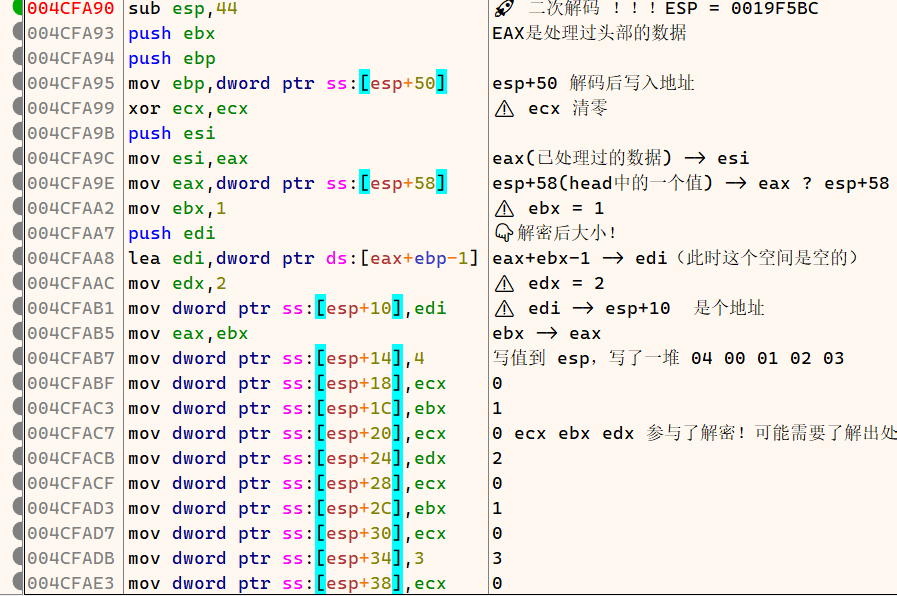

# Unpde 解密 .PDE 文件

## 此仓库仅可用于学习目的，不可用于商业目的！

## 说明

FC 版本:1.0.1.9920

所有debug分析均来自此版本

使用c#编写

## C++版本 UnPdeC

[UnPdeC](https://letleon.coding.net/public/3d/UnPdeC/git/files)


## 源码与二进制文件(不一定同步)

[百度网盘](https://pan.baidu.com/s/1MkWH6L6bsx3PJQWJuslwKw?pwd=fcfc "百度网盘")

[OneDrive](https://1drv.ms/f/s!AhZa6xQIJXNNjUoVv3AFIUxeb-Ck?e=6N12WI "OneDrive")

[123 云盘](https://www.123pan.com/s/b5Y0Vv-rN4J3.html)

#### 测试程序

[Unpde.exe](TestRelease/Unpde.exe)

你可能需要.net8 运行时才能正常运行Unpde

[.NET8 运行时](https://dotnet.microsoft.com/zh-cn/download/dotnet/8.0)


请不要用于商业目的！

#### 目前状态：
.lua .mesh .anim 等文件似乎是自定义格式!

最终解密函数存在越界问题！

可以自己查找未解密区域，但速度非常慢！

### TODO
- [x] 发现可以将.cache(未二解)文件都放到finalcombat.pde目录中，也能正常加载！
- [x] 导出的mp3听起来怪怪的可以用工具再次转码成mp3即可解决！
- [ ] 发现最终解密函数存在越界问题！
- [x] 最终解密方法添加了6F和6D标志的判断
- [x] PDEKEY改为使用函数生成
- [ ] 初步完成查找未解码目录功能，非常慢！但能全部导出到Other目录！
- [x] 为偏移值日志(OffsetLog)添加BOffset键,表示此数据在哪个块中
- [x] 添加详细的注释
- [x] 为偏移值日志(OffsetLog)添加OOffset键，表示原始偏移值
- [x] 修复保存调试用PDE时越界问题
- [x] 除了FC的PDE文件，还可以解压AS的PDE文件
- [x] 可以解压目录下任意pde文件
- [x] 修改逻辑后，可解压 1.0.1.9920 和 1.0.6.7960 版本的 PDE 数据，理论上可解任意版本 PDE 数据
- [x] 优化最终解密逻辑，判断某些不用二次解密的文件
- [x] 优化 Offsetlog，可以保存为树状结构，更直观查找
- [x] fsb 音乐文件可以用 [FSB 提取器 16.10.21 (aezay.dk)](http://aezay.dk/aezay/fsbextractor/) 正确播放，不在使用 [foobar2000](https://www.foobar2000.org/download)
- [x] 找到了两个目录地址
- [x] 不能二次解密的文件会后.cache 后缀，没有.cache 后缀的是被二次解密的文件，有些虽然没有.cache 后缀，可能会有部分文件不正常。
- [ ] 最终解密逻辑，有些文件会越界，有些没问题，还得跟~
- [ ] lua 文件二次解密后似乎还是加密的！
- [x] 初步完成貌似最终解密逻辑!🎉
- [x] 跟踪了最终解密逻辑，发现相当复杂~有空再搞把！
- [x] 找到了貌似最终解密的逻辑！！！🎉
- [x] 解密后的 DDS 文件不能正确显示！怀疑 DDS 文件被修改了！
- [ ] 未知 170 个块不知是干啥的！
- [x] 错误 解密后的 FSB 音乐以及 SWF 文件有些不完整！
- [ ] 某些目录 比如 1580 处，写的是 7000 大小 实际只有 1000 大小，导致读取的数据量不正常！还得跟~
- [x] lua 似乎不正确或是加密的！
- [x] 一个猜测，dds tag lua 可能不是真正的文件，可能只是个指针？
- [ ] 发现很多偏移值并不是只读了一次，而且有些偏移值的每次读的大小都不同！
- [x] 未跟踪 解密时大小超过 1000H 时(也就是 KEY 大小)，如何继续循环？已解决，Key 循环就行了！
- [x] 读取大资源文件时，不知从哪里抓到的偏移值，怀疑时 170 表里的值！
- [x] 已知 解密 Fun4 是解 170 表
- [x] 已知 解密 Fun1 / 2 是解密文件/文件夹表
- [x] 已知 解密 Fun 3 是解密实际单个文件的函数
- [x] 简单模拟实现了 Fun 3 抓文件夹或文件的逻辑
- [x] 简单实现了利用 1000H 的目录数据，批量导出了 1188 个文件,但文件不完整!!!
- [x] 可以以目录的方式写入磁盘
- [x] 可以输出一个解密后的 HEX 作为调试时使用
- [x] 可以输出一个全部偏移值的 JSON 供调试时使用
- [x] 添加了文件验证类，在没有找到真正文件数据之前先顶着！
- [x] 目前可解 4000 个文件，但大多数我认为不是真正的文件
- [x] OffsetLog 改成嵌套结构

---

# Build

#### 准备:

系统 windows10/11

安装 visual studio 2022 (选择 .NET 桌面开发)

打开源码，之后右键 管理解决方案的 NuGet 程序包,下载 Newtonsoft.Json v13.0.3

#### 编译:

首先你需要先 build 程序，然后会生成 Unpde\bin\x86\Debug\net8.0 目录

将 v1.0.1.9920 版本的 finalcombat.pde 文件

放置到 Unpde\bin\x86\Debug\net8.0 目录中

在比 build 或 run 即可在 Unpde\bin\x86\Debug\net8.0 目录下创建一个新的目录 Unpde

这个目录就是解密的结果目录了！

---

# 线索

## Key 获取

#### 手动获取

在 00A60950 Xor 解密函数中

往下 到达这个循环，观察 EDI ，EDI 的位置就是 KEY 的数据，

大小是 1000H（ecx）


#### 函数生成
在 00A608E0 处可以生成 KEY


## 最终解密逻辑

在 004CFA90 函数处
将初次解码的文件数据 再次处理



从内存复制处某个 DDS，DDS 可被正确识别并显示
像是个弹痕！


## 文件偏移值与大小获取方法

```
文件偏移量
  B8690200
  即 000269B8 + 1 = 000269B9H
  即可得到偏移量
  !在经过计算即可得到在PDE中的实际地址

文件大小
  56000000 -> 0x56，此文件的大小
```


## 文件与文件夹的标识以及块大小

```
🗂️ 文件夹 02
📄 文件 01
📦 块大小 80H -> 128
```


---

# 二次待解密数据分析
### 6F


```
紫色 -> 标志: 6F
黄色 -> head: 010A0000 02008100
蓝色1 & 蓝色2 -> 从0X18开始到结尾的大小: 703E4100 -> 0X413E70
红色 -> 文件数量？: 01000000 -> 0X1
绿色 -> 解码后大小: B308BA00 -> 0XBA08B3
实际参与解码的数据:
	从0x21开始(绿色竖线)到结尾
最终文件:
	需要移除前8个字节
```

### 6D


```
紫色 -> 标志: 6D
黄色 -> head: 00060000 02000300
蓝色1 & 蓝色2 -> 从0X18开始到结尾的大小: 340000 -> 0X34
红色 -> 文件数量？: 01000000 -> 0X1
绿色 -> 解码后大小: 59 -> 0X59
实际参与解码的数据:
	从0x1B开始(绿色竖线)到结尾
最终文件:
	需要移除前8个字节 ? 未验证！！！
```

# Heads (初次解码后)

**Head 分析结果如下**

#### .lua

010A0000 02000100

#### .anim

00050000 02000300

#### .fsb

46534234

#### .tga / .dds

01020000 02000100

#### .dcl

000C0000 02000200

#### .swf

4357530A

#### .ttf

00010000 00120100 00040020 44534947

#### .mesh

00010000 02000800

#### .occ

010A0000 02000100

#### .physx

00070000 02000500

#### .pd9

02040000 02000300

#### .vd9

01040000 02000300

#### .skel

00060000 02000300

#### .spr

000D0000 02000000

#### .vfx

01020000 02000100

---

# 预览

## 🎸 FSB 音乐文件播放器

#### [~~foobar2000~~](https://www.foobar2000.org/download)

~~需要用到这个老牌播放器
[vgmstream decoder](https://www.foobar2000.org/components/view/foo_input_vgmstream)~~

~~以及这个插件即可播放 FSB 音乐文件
(但现在解出的资源不完整！！！)~~

#### [FSB 提取器 16.10.21 (aezay.dk)](http://aezay.dk/aezay/fsbextractor/)

可正确识别 fsb 文件内的所有音频，以及可以提取音频

    有些音乐听起来可能怪怪的，
    可以用音乐转换工具将mp3还转换成mp3格式就可以正常听了。
    比如千千静听,foobar2000都内置转换器！

#### Radio 部分 可用在线预览

[百度网盘 -&gt; 解码测试 &gt;音乐解码测试 &gt;](https://pan.baidu.com/s/1MkWH6L6bsx3PJQWJuslwKw?pwd=fcfc)

---

## 🖼️ DDS 预览

~~#### [Texture Tools Exporter | NVIDIA Developer](https://developer.nvidia.com/texture-tools-exporter)~~

#### [TacentView]([Tools/DDSView.html](https://github.com/bluescan/tacentview))

Git del repositorio original 
https://e.coding.net/letleon/3d/Unpde.git
