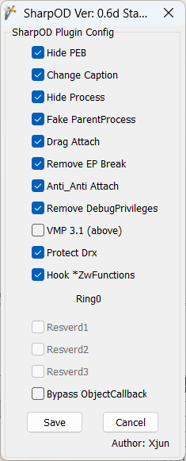
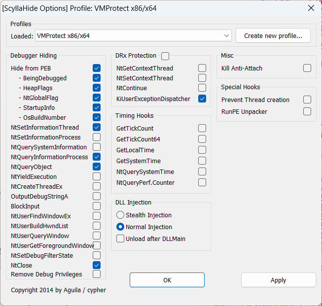

# 插件

## 使用中

### [SharpOD](<[https://down.52pojie.cn/Tools/OllyDbg_Plugin/SharpOD_x64_v0.6d_Stable.zip](https://down.52pojie.cn/Tools/OllyDbg_Plugin/SharpOD_x64_v0.6d_Stable.zip)>)

和 ScyllaHide 一起使用,配置如下

### [Scylla Hide](https://github.com/x64dbg/ScyllaHide)

和 SharpOD 一起使用,配置如下

## 已淘汰

### [TitanHide](https://github.com/mrexodia/TitanHide)

这个容易蓝屏

### [EfiGuard](https://github.com/Mattiwatti/EfiGuard)

想要使用 TitanHide 需要先装这个！

[UEFI 方式启动 EfiGuard - letleon - 博客园 (cnblogs.com)](https://www.cnblogs.com/letleon/p/18025063)
这是我写的安装教程

### [DbGit](https://github.com/x64dbg/DbGit)

X64DBG 调试数据库备份插件
我丢过好多次~日志备注断点都无了~~

### TitanHide_BAT

是 TitanHide 创建 启动 停止脚本
